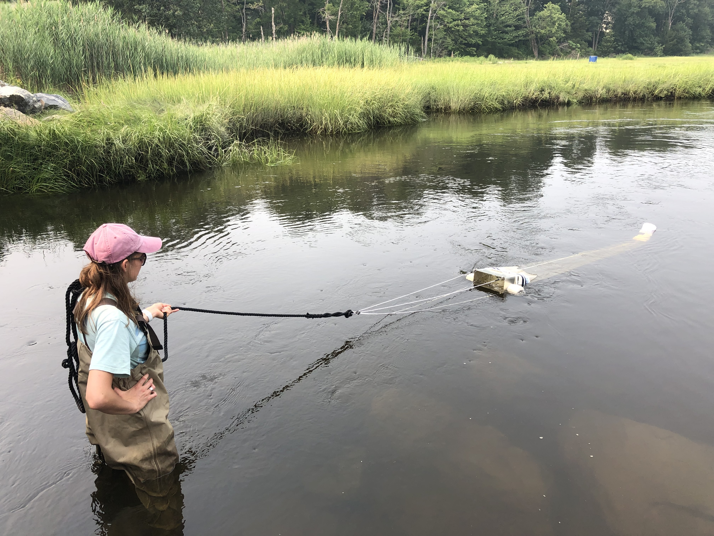

Hi there! My name is Hanna and I am originally from Auburn, Maine. I received my undergraduate degree in Biology and Environmental Science & Policy from Smith College in 2014. After spending 6 years working in the non-profit environmental sector, I decided to return to school to get my master’s degree. I joined the Moore Lab at UNH in the fall of 2020. My research is focused on assessing the presence and concentrations of microplastics in the Hampton-Seabrook Estuary located in Southern New Hampshire. I am especially interested in understanding how factors such as tidal phase and coastal flooding may impact microplastic trends. When I am not on campus, I am in Northern MA with my partner Spencer and our two adventurous pups, Piper + Mako!

