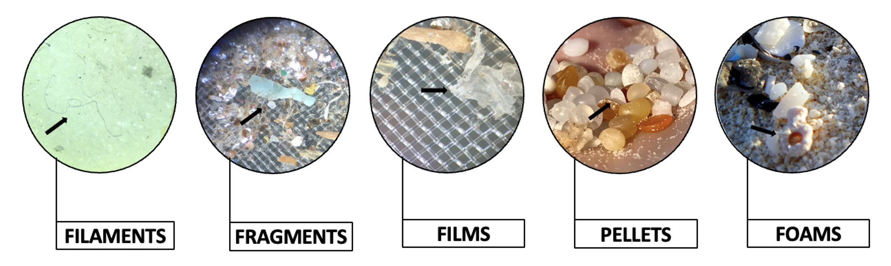

Microplastics, defined as small plastic particles less than 5 mm in size, are an emerging environmental concern. Their presence poses threats to environmental and human health due to their pervasive and persistent nature and their association with persistent, bioaccumulative, and toxic (PBT) chemicals. Microplastics were first reported in marine environments in the 1970s. Since then, worldwide production of plastic has increased by nearly eight times. While plastic production has continued to surge, systems of plastic waste recovery have not kept up. Today, microplastics are prolific in marine environments, having been found in all major marine habitats. With an estimated 80% of marine microplastics originating from land-based sources, coastal habitats situated at the intersection of terrestrial and aquatic environments, are critical ecosystems of concern. Studies have been done to assess pathways of transport into these systems, however few have focused on coastal flooding events as a vector. With increasing sea levels and more frequent coastal flooding events due to climate change, understanding the role that these events play in microplastic transport is critical to long-term management. This is where my research comes in. 

